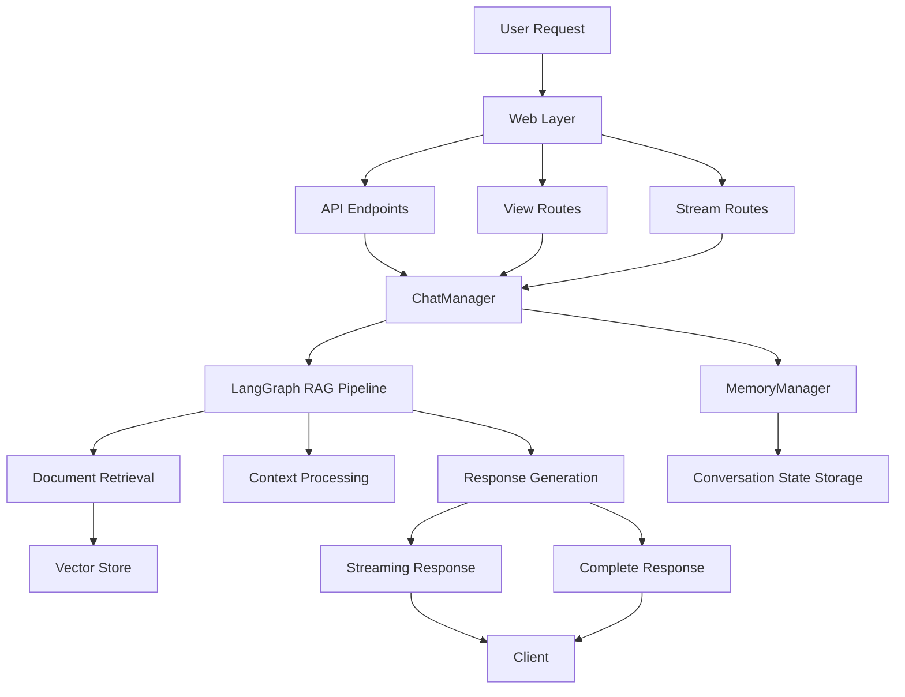

# PDF RAG Project: LangGraph Architecture Migration

## Overview

This document outlines the migration from a legacy database-centric architecture to a modern LangGraph-based architecture in our PDF RAG (Retrieval Augmented Generation) project. It includes the code flow, components, and remaining tasks to complete the refactoring.

## Architecture Transformation

### Before: Database-Centric Architecture
- Relied heavily on database models for conversation state
- Stored messages as individual records
- Used database transactions for state updates
- Required complex query logic for retrieving conversation history

### After: LangGraph-Based Architecture
- Uses in-memory state management with persistent backing
- Leverages LangGraph for the RAG pipeline
- Treats conversations as complete state objects
- Implements clean separation between web layer and processing logic

## Code Flow Map



## Key Components

### ChatManager (`app/chat/chat_manager.py`)
The central orchestrator for the entire chat system.

```python
class ChatManager:
    def __init__(self, args: ChatArgs):
        self.memory_manager = MemoryManager()
        self.conversation_id = args.conversation_id
        self.conversation_state = None
        self.research_mode = args.research_mode or ResearchMode.SINGLE
        # ...

    async def initialize(self):
        # Load conversation state
        if self.conversation_id:
            self.conversation_state = await self.memory_manager.get_conversation(self.conversation_id)
        # ...

    async def query(self, query: str) -> Dict:
        # Process query through LangGraph
        # ...

    async def stream_query(self, query: str) -> AsyncGenerator:
        # Stream responses through LangGraph
        # ...
```

### MemoryManager (`app/chat/memories/memory_manager.py`)
Handles persistence and retrieval of conversation state.

```python
class MemoryManager:
    def __init__(self):
        self.storage_path = "path/to/storage"
        # ...

    async def get_conversation(self, conversation_id: str) -> ConversationState:
        # Retrieve conversation state
        # ...

    async def save_conversation(self, conversation: ConversationState) -> bool:
        # Save conversation state
        # ...

    async def list_conversations(self) -> List[ConversationSummary]:
        # List available conversations
        # ...

    async def delete_conversation(self, conversation_id: str) -> bool:
        # Delete conversation state
        # ...
```

### Web Layer

#### API Endpoints (`app/web/api.py`)
Backend API for chat processing and document handling.

```python
@app.route("/api/query", methods=["POST"])
async def process_query():
    # Process query using ChatManager
    chat_manager = ChatManager(ChatArgs(...))
    await chat_manager.initialize()
    return await chat_manager.query(request.json["query"])
```

#### View Routes (`app/web/views/conversation_views.py`)
Web routes for conversation management.

```python
@bp.route("/<string:conversation_id>/messages", methods=["GET"])
@login_required
def get_conversation_messages(conversation_id):
    # Get messages using ChatManager
    chat_manager = ChatManager(ChatArgs(conversation_id=conversation_id))
    run_async(chat_manager.initialize())
    # ...
```

#### Stream Routes (`app/web/views/stream_views.py`)
Streaming endpoints for real-time response delivery.

```python
@bp.route("/<string:conversation_id>/chat", methods=["POST"])
@login_required
def stream_chat(conversation_id):
    # Stream chat responses
    def generate():
        chat_manager = ChatManager(ChatArgs(...))
        # ...
        async for chunk in chat_manager.stream_query(query):
            yield json.dumps(chunk) + "\n"
    
    return Response(stream_with_context(generate()), mimetype='application/x-ndjson')
```

## Conversation State Management

Conversations are now represented by a `ConversationState` object:

```python
class ConversationState:
    def __init__(self, id: str, title: str = None):
        self.id = id
        self.title = title
        self.messages = []
        self.metadata = {}
        self.created_at = datetime.now()
        self.updated_at = datetime.now()

    def add_message(self, role: str, content: str):
        self.messages.append(Message(role=role, content=content))
        self.updated_at = datetime.now()
```

## Remaining Tasks

### 1. Testing
- [ ] Create comprehensive test suite for ChatManager
- [ ] Test all API endpoints with different scenarios
- [ ] Test research mode functionality
- [ ] Verify streaming functionality
- [ ] Performance testing with large documents and conversation histories

### 2. Error Handling
- [ ] Implement robust error handling in ChatManager
- [ ] Add detailed error logging
- [ ] Create user-friendly error responses
- [ ] Handle edge cases (missing files, corrupted state, etc.)

### 3. Cleanup
- [ ] Remove legacy database models no longer needed
- [ ] Delete unused imports and dependencies
- [ ] Remove any commented-out legacy code
- [ ] Check for lingering database dependencies

### 4. Documentation
- [ ] Update API documentation
- [ ] Create detailed architecture documentation
- [ ] Add code comments for complex logic
- [ ] Document the migration process for future reference

### 5. Frontend Compatibility
- [ ] Verify frontend works with new backend
- [ ] Update any frontend code that relied on database structure
- [ ] Test research mode UI
- [ ] Ensure streaming UI functions correctly

## How to Continue

1. **Run Tests**: Execute tests to identify any remaining issues or bugs
2. **Fix Edge Cases**: Address any edge cases found during testing
3. **Clean Up Code**: Remove all unused legacy code and dependencies
4. **Documentation**: Complete documentation for the new architecture
5. **Deploy**: Create a staging deployment for final testing before production release

## Benefits of the New Architecture

- **Improved Performance**: Less database overhead, more efficient state management
- **Better Modularity**: Clean separation of concerns between components
- **Enhanced Flexibility**: Easier to extend with new features
- **Simplified Code**: More straightforward logic flow, less complexity
- **Better Scalability**: LangGraph provides better scaling characteristics

---

*This document will be updated as the refactoring progresses*
